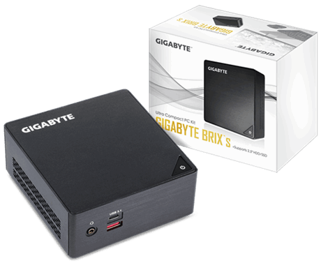

# Tom's sandbox area

This project is essentially me geeking around at home

## Hardware

I use a [Gigabyte BrixS GB-BKi7HA-7500](https://www.gigabyte.com/Mini-PcBarebone/GB-BKi7HA-7500-rev-10#ov). 2x16GB of RAM and a Pci-e 256GB 


## Setup ESXi 

Create a user with privileges to create vms
Create some Port groups: LAB2 [vlan2], LAB3 [vlan3]

## Create and configure the initial VM

Mount a CentOS7 minimal ISO file

Create a CentOS VM manually with 3 network interfaces:
 - VM Network
 - LAB2
 - LAB3

Post-install:

 - Create an ansible user, grant passwordless sudo

Register the IP address of the bootstrap box or set it manually to something. 

## Set up ansible

Edit ansible/hosts

```ini
[dhcp]
<BOOTSTRAP_IP> ansible_become=true kickstart_ip=10.0.0.1
```

Create a `~/.ansible_vault_password` with some secret content

Edit some password files with ansible-vault: 

```bash
ansible-vault edit ansible/roles/pxe-stack/vars/secrets.yml --vault-password-file=~/.ansible_vault_password
```

```yaml
root_password_hash: <ROOT_PASSWORD_HASH>
ansible_password_hash: <ANSIBLE_PASSWORD_HASH>
ansible_pub_key: <ANSIBLE_SSH_PUBKEY>
```

## Configure the pxeboot machine

Run ansible playbook against bootstrap node

```bash
ansible-playbook -i ${HOSTS_FILE} --vault-password-file=~/.ansible_vault_password ansible/pxe-stack.yml $@
```

## Configure terraform

Create a ~/secret.tfvars with the following content, chmod it 0600
```
vsphere_user="<YOUR_ESXI_USERNAME>"
vsphere_password="<YOUR_ESXI_PASSWORD>"
```

## Hardcoded infrastructure components

 - PXE_SERVER. Use this right now as a way of storing downloadable components 
 - CONSUL_VIP. Useful to access the ui from a workstation. Otherwise access to consul is done via a local consul agent
 - CONSUL_SERVER. Currently 3 and regisered [here](https://github.com/tomdymond/homelab/blob/master/terraform/source/vsphere-vm/_vars.tf#L14). To change this, re-run the consul-experiments terraform stuff


