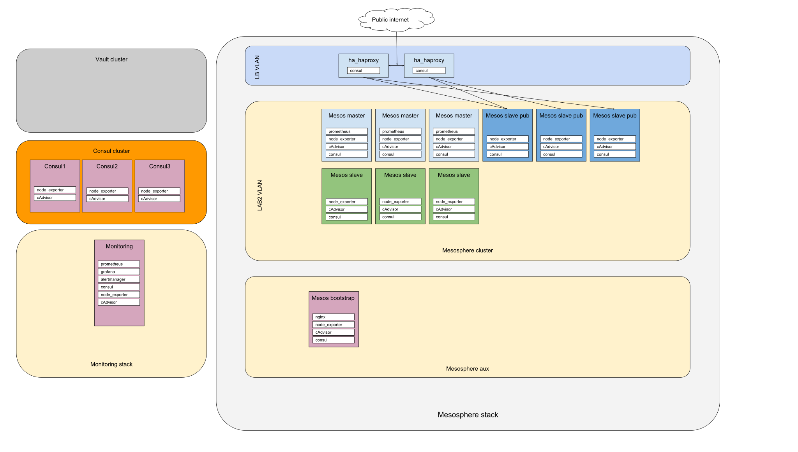

This is me testing stuff only. Hopefully not doing it too wrong :)

- Create LB vlan
- Create haproxy-keepalived load balancers, loadbalancing to public nodes
- Create slave and master nodes first, getting the IP outputs from terraform. Start a service on them that essentially waits for the boostrap node to appear in consul
- Create the bootstrap and haproxy nodes next passing in the ip addresses of the slave and master nodes to both

[source](https://docs.google.com/drawings/d/1wnA2-bbvFetr4M1jqSpdjD-cQ57xnWGcSMhmoskxSvI/edit?usp=sharing) 

